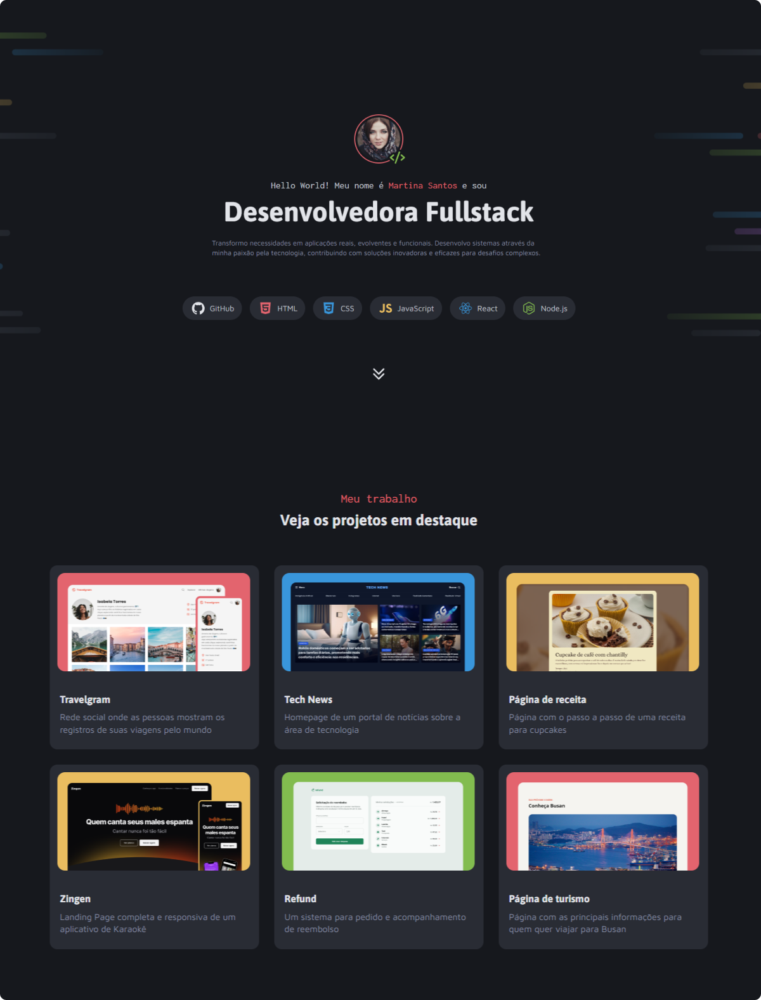

# Portfólio Dev

    

## Projeto
> 

Esse é o primeiro desafio do módulo 4, onde tive um projeto prático: criar um portfólio dev utilizando tudo que aprendi até agora. Também aproveitei para estilizar a barra de rolagem.

## 🛠️ Tecnologias utilizadas

- HTML
- CSS